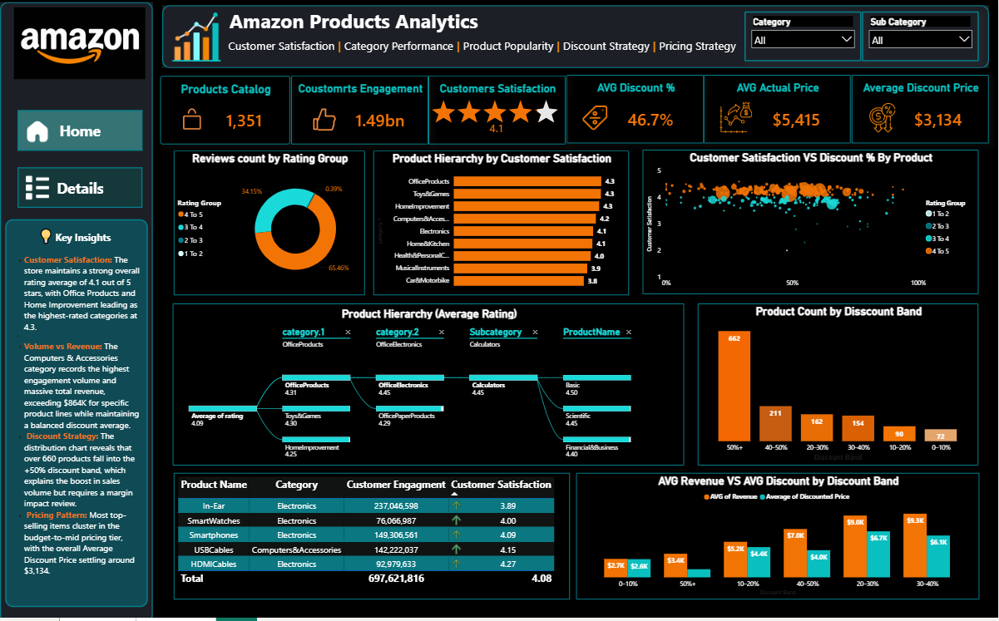
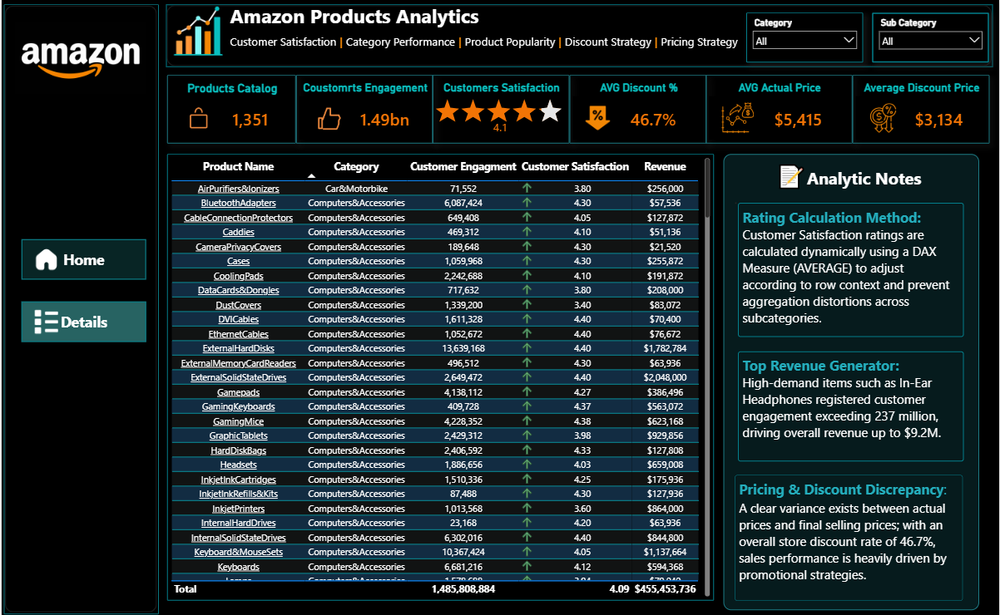

# 📊 Amazon Products Analytics Power BI Dashboard

An executive-level, interactive two-page Power BI dashboard designed to analyze e-commerce product performance, pricing dynamics, discount strategies, and customer satisfaction metrics.

---

## 🛠️ Key Features & Interactivity
- **Executive Overview (Page 1):** Highlights key KPIs (Catalog Count, Total Engagement, Average Rating, Discount %, Pricing) alongside rating distributions, satisfaction hierarchies, and discount band counts.
- **Details & Deep-Dive Analysis (Page 2):** Tabular analysis of product-level metrics, customer engagement, satisfaction scores, and revenue generation.
- **Interactive UI & Filtering:** Modern dark-themed layout with synchronized slicers for Category and Sub-Category across all visuals.
- **Insight Cards:** Dedicated textual cards providing instant executive insights and analytical notes.
---

## 📐 Data Modeling & DAX Measures
- **Data Model:** Structured star schema built in Power Query with cleaned e-commerce attributes, category hierarchies, and pricing dimensions.
- **DAX Calculations:** Custom measures implemented to ensure accurate row-level evaluation context (e.g., dynamic average ratings) and prevent rate-aggregation distortions across categories.
  - `Average Rating`
  - `Total Engagement`
  - `Average Discount %`
  - `Total Revenue`

---

## 📂 Repository Contents
- **`Dashboard/`**: Contains the full `.pbix` Power BI interactive report file.
- **`Dataset/`**: Contains the raw CSV data source used for transformation and modeling.
- **`Images/`**: High-resolution screenshots of the dashboard pages.
---

## 📸 Previews

### Page 1: Home

### Page 2: Details

